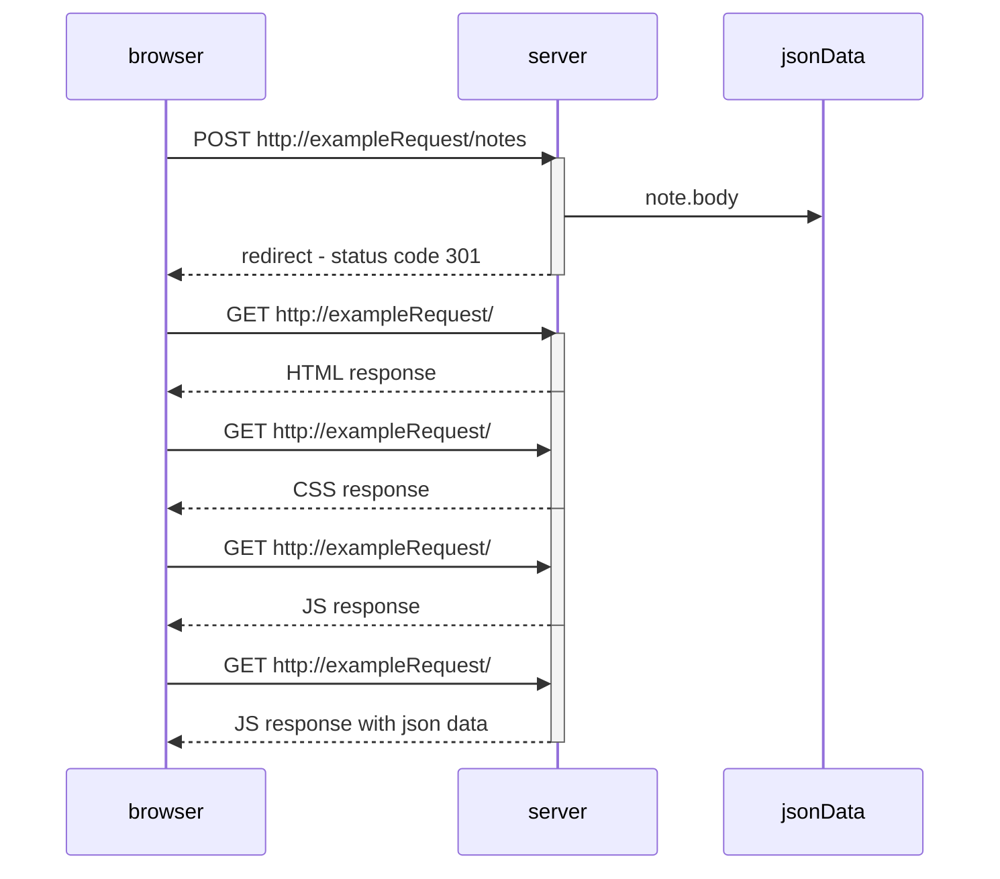

```mermaid
sequenceDiagram
  participant browser;
  participant server;
  participant jsonData;

  browser->>server: POST http://exampleRequest/notes;
  activate server;

  server->>jsonData: note.body;
  server-->>browser: redirect - status code 301;
  deactivate server;

  browser->>server: GET http://exampleRequest/;
  activate server;
  server-->>browser: HTML response;
  deactivate server

  activate server;
  browser->>server: GET http://exampleRequest/;
  server-->>browser: CSS response;
  deactivate server

  activate server;
  browser->>server: GET http://exampleRequest/;
  server-->>browser: JS response;
  deactivate server

  activate server;
  browser->>server: GET http://exampleRequest/;
  server-->>browser: JS response with json data;
  deactivate server
```
