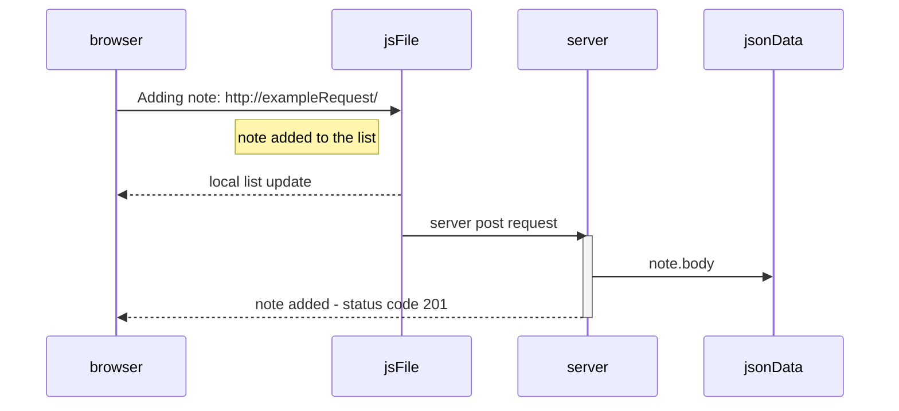

```mermaid
sequenceDiagram
  participant browser;
  participant jsFile

  participant server;
  participant jsonData;

  browser->>jsFile: Adding note: http://exampleRequest/;
  note left of jsFile: note added to the list;
  jsFile-->>browser: local list update;

  jsFile->>server: server post request;
  activate server;
  server->>jsonData: note.body;
  server-->>browser: note added - status code 201;
  deactivate server
```
