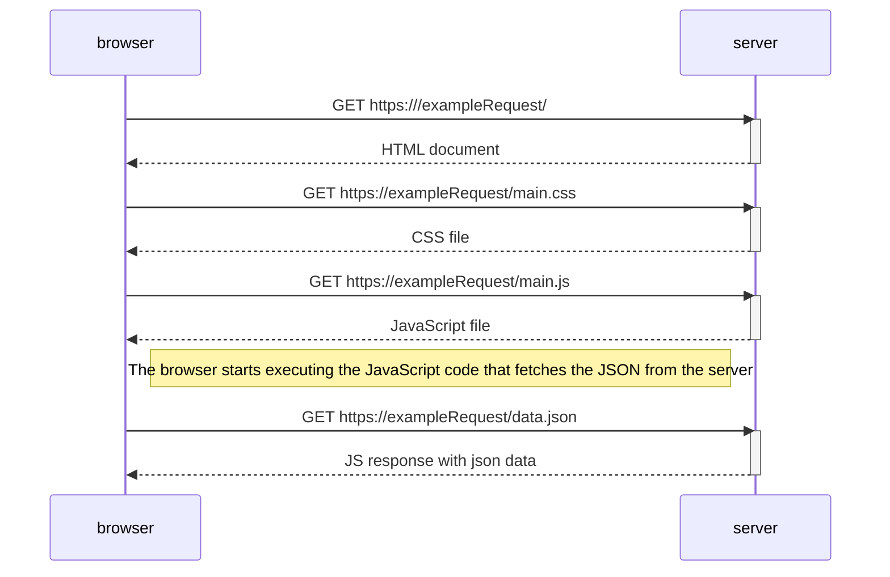

```mermaid
sequenceDiagram
  participant browser
  participant server

  browser->>server: GET https:///exampleRequest/
  activate server
  server-->>browser: HTML document
  deactivate server

  browser->>server: GET https://exampleRequest/main.css
  activate server
  server-->>browser: CSS file
  deactivate server

  browser->>server: GET https://exampleRequest/main.js
  activate server
  server-->>browser: JavaScript file
  deactivate server

  Note right of browser: The browser starts executing the JavaScript code that fetches the JSON from the server

  browser->>server: GET https://exampleRequest/data.json
  activate server
  server-->>browser: JS response with json data
  deactivate server    
```
