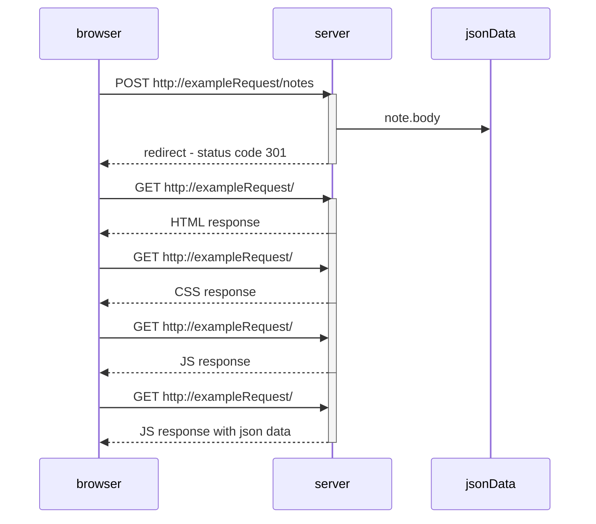
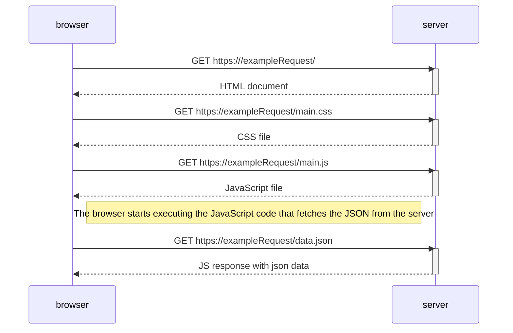
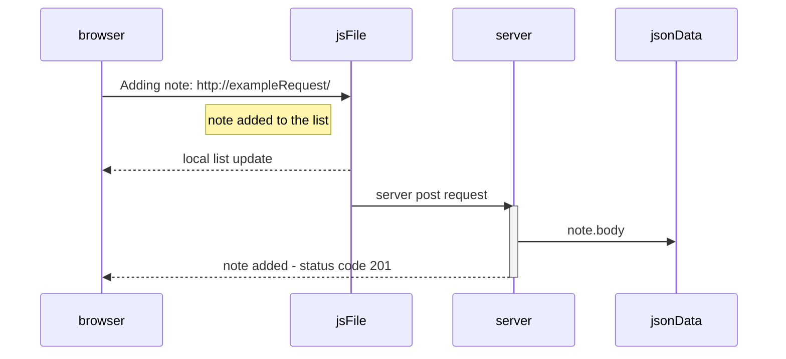

```mermaid
sequenceDiagram
  participant browser;
  participant server;
  participant jsonData;

  browser->>server: POST http://exampleRequest/notes;
  activate server;

  server->>jsonData: note.body;
  server-->>browser: redirect - status code 301;
  deactivate server;

  browser->>server: GET http://exampleRequest/;
  activate server;
  server-->>browser: HTML response;
  deactivate server

  activate server;
  browser->>server: GET http://exampleRequest/;
  server-->>browser: CSS response;
  deactivate server

  activate server;
  browser->>server: GET http://exampleRequest/;
  server-->>browser: JS response;
  deactivate server

  activate server;
  browser->>server: GET http://exampleRequest/;
  server-->>browser: JS response with json data;
  deactivate server
```

```mermaid
sequenceDiagram
  participant browser
  participant server

  browser->>server: GET https:///exampleRequest/
  activate server
  server-->>browser: HTML document
  deactivate server

  browser->>server: GET https://exampleRequest/main.css
  activate server
  server-->>browser: CSS file
  deactivate server

  browser->>server: GET https://exampleRequest/main.js
  activate server
  server-->>browser: JavaScript file
  deactivate server

  Note right of browser: The browser starts executing the JavaScript code that fetches the JSON from the server

  browser->>server: GET https://exampleRequest/data.json
  activate server
  server-->>browser: JS response with json data
  deactivate server    
```

```mermaid
sequenceDiagram
  participant browser;
  participant jsFile

  participant server;
  participant jsonData;

  browser->>jsFile: Adding note: http://exampleRequest/;
  note left of jsFile: note added to the list;
  jsFile-->>browser: local list update;

  jsFile->>server: server post request;
  activate server;
  server->>jsonData: note.body;
  server-->>browser: note added - status code 201;
  deactivate server
```
